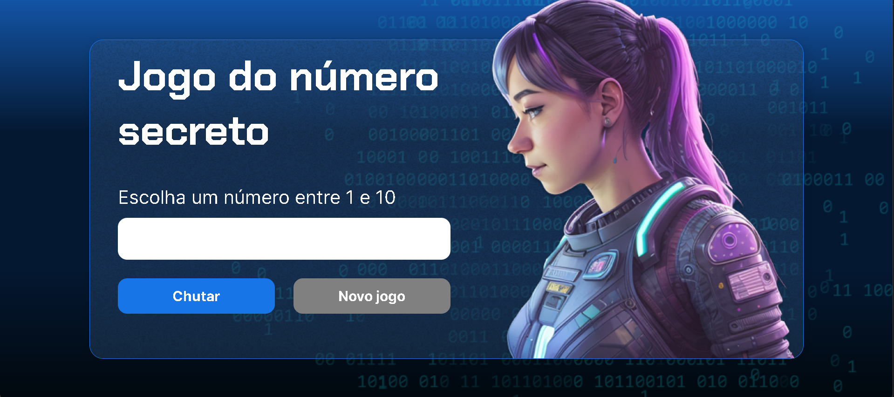

# Jogo do Número Secreto

Um jogo simples para descobrir o número secreto, feito durante o curso de lógica de programação com JavaScript da Alura.

## 🔨 Funcionalidades do projeto

Nesse projeto, você deve tentar descobrir qual é número secreto, sendo ele, um número de 1 a 10. Na página, existe um input onde você pode inserir o valor para verificar se acertou o número ou se o número digita é menor ou maior que o número secreto. Ao acertar o número secreto, o programa irá te informar em quantas tentativas você descobriu. O programa possui leitura por voz de alguns textos que aparecem na tela. 

## ✔️ Técnicas e tecnologias utilizadas

As técnicas e tecnologias utilizadas pra isso são:

- `HTML e CSS`: Foi dado um layout base da pagina no curso em que esse projeto foi feito.
-  `JavaScript`: A lógica do programa foi feita interamente com JavaScript.
- `ResponsiveVoice`: Sistema de leitura de tela de alguns textos.

  
  
  

## 📁 Acesso ao projeto

Você pode [baixar o arquivo zip](https://github.com/Christian-Rui/numero-secreto/archive/refs/heads/main.zip).

## 🛠️ Abrir e rodar o projeto

Após baixar o projeto, você pode abrir com o Visual Studio Code para acessa-lo e modificar o código. Para isso, na tela inicial clique em:

- **Open Folder** (ou alguma opção similar)
- Procure o local onde o projeto está e o selecione (Caso o projeto seja baixado via zip, é necessário extraí-lo antes de procurá-lo)
- Por fim clique em OK

Para  abrir, basta clicar duas vezes no arquivo **index.html** que ele será aberto no seu navegador, e você poderá testar suas funcionalidades

# Time

| [ Christian Rui](https://github.com/Christian-Rui)
| :---: |
